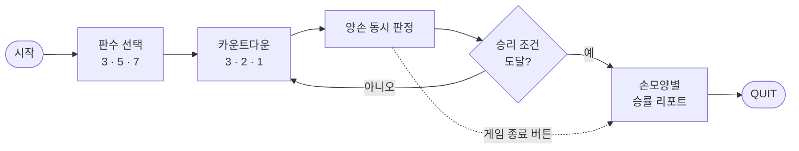

<div align="center">

# 🖐️ HandClash

### 웹캠 손 제스처 대전 가위바위보

웹캠 한 대로 두 사람이 동시에 손을 내밀어 겨루고,<br>
대결이 끝나면 **손모양별 승률 리포트**를 보여주는 프로그램입니다.

[](https://www.python.org/)
[](https://developers.google.com/mediapipe)
[](https://opencv.org/)
[](LICENSE)

</div>

---

## ✨ 이런 게임이에요

- 🎮 **사람 대 사람** — 한 화면을 좌우로 나눠 P1·P2가 각자 손을 내밀어요
- ✋ **실시간 판정** — MediaPipe로 양손을 동시에 인식해 가위·바위·보를 가려요
- 📊 **습관 리포트** — 손모양별로 몇 번 냈고 몇 번 이겼는지 승률로 보여줘요

## 🧩 주요 기능

| 기능 | 설명 | 담당 |
|:----:|------|:----:|
| 공통 코드 | MediaPipe 양손 인식, 화면 좌/우로 P1·P2 구분 | 최성민 |
| `gesture.py` | 손가락 펴짐 배열로 가위·바위·보 판정 | 김화섭 |
| `game.py` | 판수(3·5·7) 선택 대결, 중간 종료 시 누적 점수로 승자 판별 | 최성민 |
| `record.py` | 대결 기록 CSV 저장, 손모양별 횟수·승률 리포트 | 서진서 |
| `ui.py` | 카운트다운, 좌우 분할 화면, 판수·종료 버튼, 점수판 | 김나영 |

## 🔄 게임 진행 흐름



## 🚀 설치와 실행

Python 3.12 이상이 필요하고, 웹캠이 연결되어 있어야 합니다.

<!-- 테스트한 Python 버전을 실제로 확인한 뒤 위 줄에 적어 주세요 (예: 3.13에서 테스트). -->

```bash
# 1) 저장소 받기
git clone https://github.com/khseob2/RPS.git
cd RPS

# 2) 라이브러리 설치
pip install -r requirements.txt

# 3) 실행
python main.py
```

## 🕹️ 사용법

1. `python main.py`를 실행하면 웹캠 화면이 좌우로 나뉘어 열립니다. 왼쪽 손은 **P1**, 오른쪽 손은 **P2**로 인식합니다.
2. 화면 상단의 판수 버튼(**3 / 5 / 7**)을 클릭하면 해당 판수로 대결이 시작됩니다. 기본값은 3판 2선승입니다.
3. `3, 2, 1` 카운트다운이 끝나는 순간 양손 모양을 동시에 판정해 승패를 가립니다.
4. **게임 종료 버튼**을 누르면 그 시점의 누적 점수로 승자를 판별하고(동점이면 무승부), 리포트 화면이 표시됩니다.
5. 리포트 화면에서는 플레이어별로 다음과 같은 통계를 볼 수 있습니다.

   ```text
   바위: 5번 (그중 3번 승, 승률 60%)
   가위: 4번 (그중 1번 승, 승률 25%)
   보  : 3번 (그중 3번 승, 승률 100%)
   ```

6. 리포트 화면의 **종료(QUIT) 버튼**을 누르면 창이 닫힙니다.

## 👥 팀원

**팀명: RPS**

| 김화섭 | 최성민 | 서진서 | 김나영 |
| :---: | :---: | :---: | :---: |
|  |  |  |  |
| 팀장 | 개발 리드 | 문서 담당 | 리뷰·품질 담당 |
| [@khseob2](https://github.com/khseob2) | [@J0RMUN64ND](https://github.com/J0RMUN64ND) | [@seojinseo123](https://github.com/seojinseo123) | [@doranayoung](https://github.com/doranayoung) |

## 📄 라이선스

MIT License — see [LICENSE](LICENSE)
